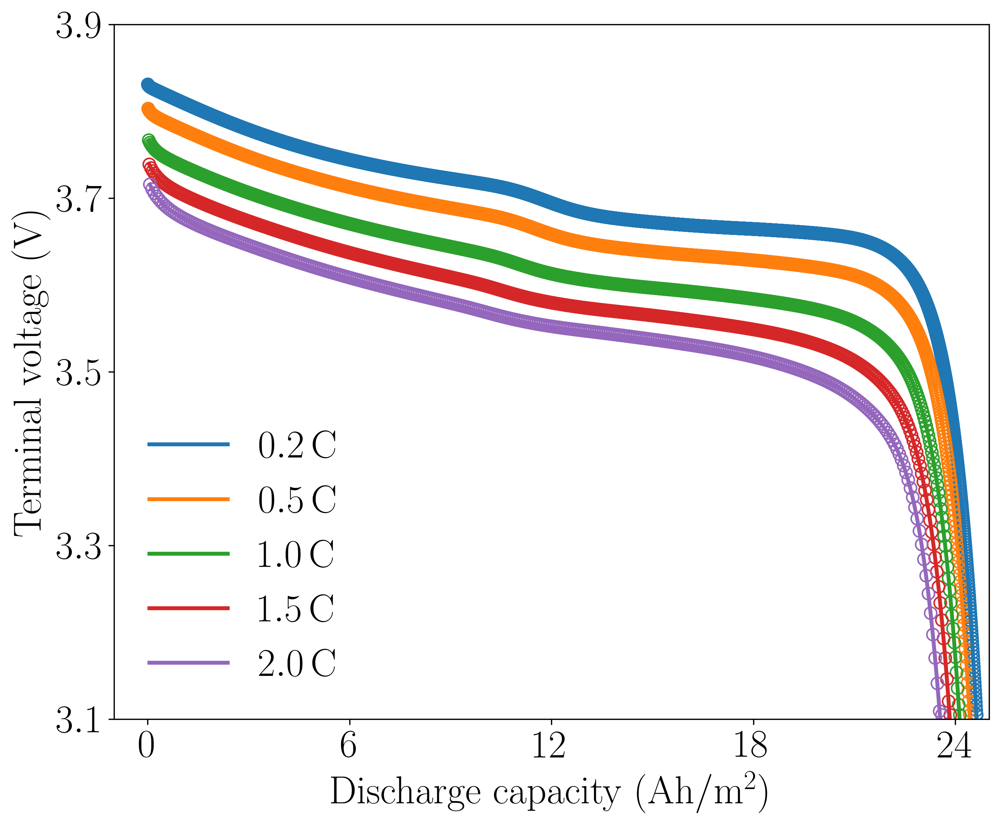
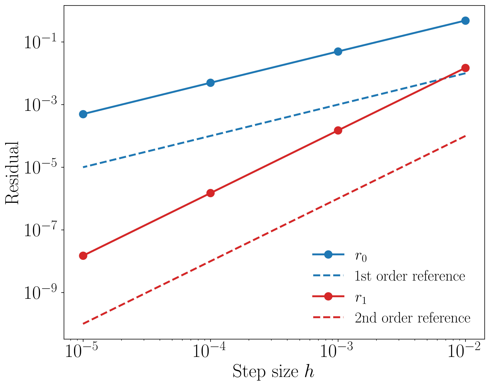

# DiffLiB

<p align="middle">
  
</p>

A differentiable simulation framework for solving forward and inverse problems of :battery: lithium-ion batteries :battery:, with the backend support of the modern scientific computing framework [JAX](https://docs.jax.dev/en/latest/) and the differentiable finite element analysis library [JAX-FEM](https://github.com/deepmodeling/jax-fem).

## Features

:high_brightness: **High-fidelity modeling**: Modeling with real battery geometries

:high_brightness: **Automatic computation of Jacobian**: Ready to incoprate multi-physics coupling mechanisms

:high_brightness: **End-to-end differentiability**: Automatic computation of parameter sensitivities


## Installation

First intsall `JAX` (see [JAX installation guide](https://docs.jax.dev/en/latest/installation.html)), then follow the [JAX-FEM instructions](https://github.com/deepmodeling/jax-fem?tab=readme-ov-file#installation) to install `JAX-FEM`, which will create a new conda environment. Activate the environment and clone the repository:

```bash
git clone https://github.com/xwpken/DiffLiB.git
cd DiffLiB
```

then install the package locally:

```bash
pip install -e .
```

## Examples

### Forward predictions
Change to the cloned directory and run
```bash
python -m examples.forward.main
```
<p align="middle">
  
</p>
<p align="middle">
    <em >Variation of the terminal voltage during the constant-discharge.(Solid lines: DiffLiB; markers: PyBaMM)</em>
</p>


### Gradient computations
Change to the cloned directory and run

```bash
python -m examples.gradient.main
```

<p align="middle">
  
</p>
<p align="middle">
    <em >Taylor test results for the validation of gradient computations.</em>
</p>

Validation with the finite difference method
```bash
grad_ad.shape = (8,)
grad_fd.shape = ()
grad_ad can give the gradient all at once, but grad_fd can only give one value!
Let's compare the value by both methods:
grad_ad[0] = -3.883050e+00
grad_fd = -3.883050e+00
Relative error = 0.000013%
```

### Others

:mega: Coming soon!

## License

This project is licensed under the GNU General Public License v3 - see the [LICENSE](https://www.gnu.org/licenses/) for details.

## Citations

If you found this library useful, we appreciate your support if you consider citing the following paper:

```bibtex
to be added
```